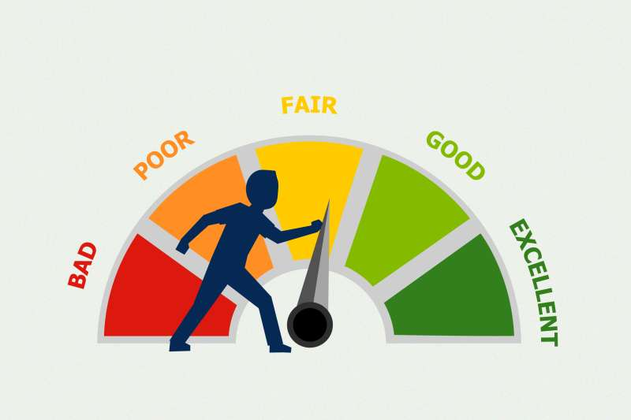

<i>Sourced: Money, Getty Images</i>

## Description

This notebook builds classification models using sklearn for classifying customers with good and bad credit.  Varying scoring models and scoring metrics were compared for educational purposes.
Data and description can be found at https://www.openml.org/d/31

## Contents

<ins>Notebook follows the following workflow:</ins>
1. EDA - analysis of categorical and continous features
2. Modeling
3. Model tuning and probability calibrations
4. Feature reduction

<ins>The following models were evaluated:</ins>
* ElasticNet (accuracy = 0.80)
* Lasso (accuracy = 0.80)
* Ridge (accuracy = 0.80)
* SVC (accuracy = 0.70)
* Random Forest (accuracy = 0.69)

Random Forest classifier probabilities were then calibrated and PCA performed for feature reduction.

<b>P.S. convergence errors occured during grid search.  The covergence errors resulted in lower scores, therefore those warnings can be ignored.</b>
